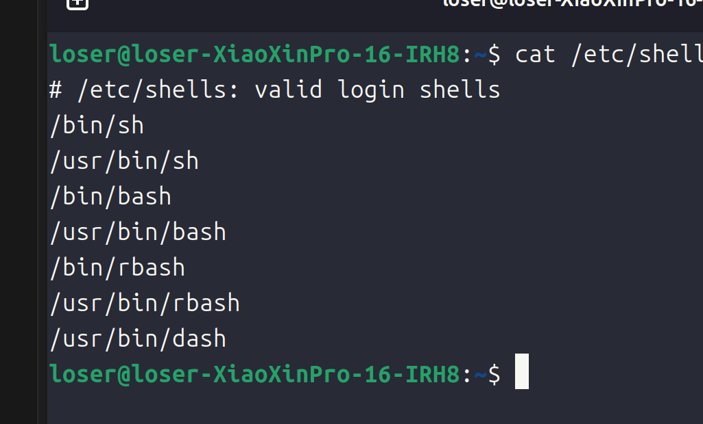
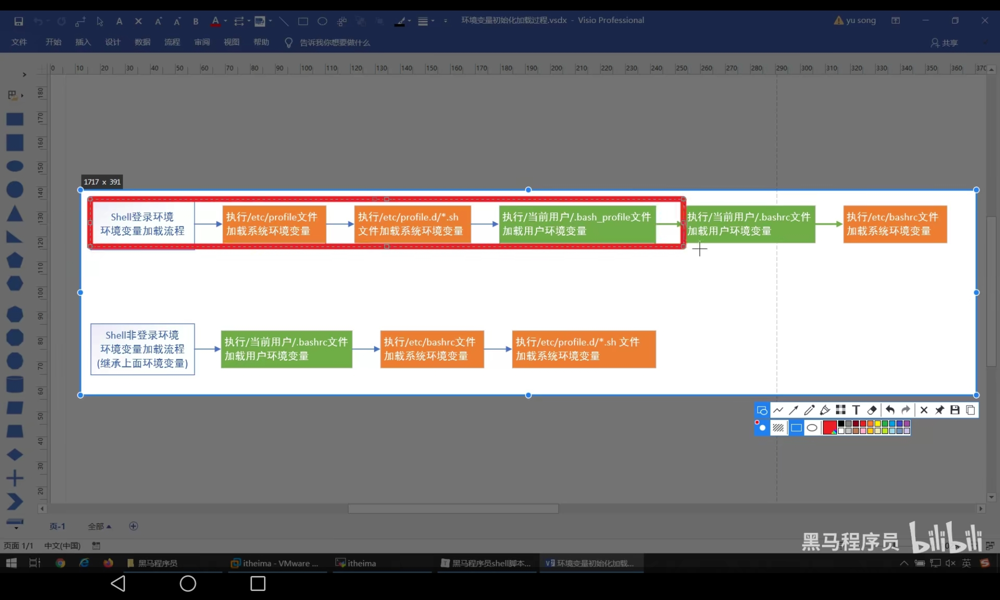
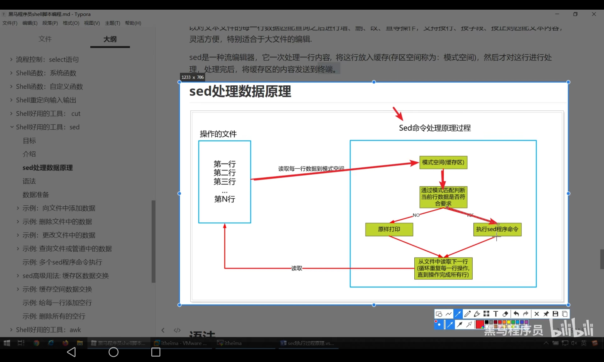

# Shell编程
## Shell介绍
- `linux` 通过内核操作计算机硬件,内存,磁盘,显示器等
- 通过编写`Shell`命令发送给 `linux` 内核去执行,操作的就是计算机硬件,所以 `Shell`命令是用户操作计算机硬件的桥梁
- `Shell`是一门程序程序设计语言,含有变量,流程控制语句等
- `Shell`就是通过`shell`命令编写的`shell`文本文件,也就是`shell`脚本
- `shell`脚本 --> `shell` 解析器 --> 内核  ---> 响应 
- 支持的`shell`解析器如下,一般使用 `bash`
- 利用 `$SHELL` 可以查看默认的 `shell` 解析器, `$SHELL` 是全局环境变量,所有 `shell`程序都可以访问的

## Shell入门
- 后缀名: `.sh`
- 首行需要时设置: `#!/bin/bash`  表示采用 `bash`解析
- 注释格式: `#`    多行: `:<<!   # 内容1   # 内容2  !` 
- 执行方式:
  - `sh`解析器执行方式  `sh Xxx.sh`
  - `bash`解析器解析方式 `bash Xxx.sh`
  - 仅路径执行方式  `./Xxx.sh` 需要权限
## 环境变量
- 系统环境变量: 是系统提供的共享变量,是`linux`系统加载`shell`配置文件中定义的变量共享给所有的`shell`程序使用:
  - 全局配置文件
    - `/etc/profile`  
    - `/etc/profile.d/*.sh`
    - `/etc/bashrc`
  - 个人配置文件:
    - /.bash_profile
    - /.bashrc
- 用户级环境变量: `Shell` 加载个人配置文件,共享给当前当前用户的`Shell`程序使用

- 自定义变量:

- 特殊符号变量: 

- 可以使用 `set` 变量查看所有函数和系统变量
- 常用的环境变量:
  - `PATH` 设置命令的搜索路径,使用 : 分割
  - `HISTFILE` 表示命令列表
  - `SHELL` 当前解析器
  - `LANG` 表示使用的字符编码方式
- `env` 用户查看系统环境变量  `set` 还会查看自定义变量和函数
### 自定义变量
- 自定义局部变量(定义在一个脚本文件中的变量只能在这一个脚本文件中使用的变量) `变量名=变量值`  注意没有空格,不可以使用关键字作为变量名称
- 自定义常量: 设置值之后就不可以修改了 `readonly 变量名=变量值`
- 自定义全局变量
- 查询变量的值:
  - `$变量名`
  - `${变量名}` 适合拼接字符串
- 删除变量: `unset 变量名`
### 父子Shell环境介绍
- 如果在 `A.sh` 中执行了 `B.sh` 那么`A.sh`就是父`Shell`环境,`B.sh`就是子`Shell`环境
- 如果在 `A.sh`中定义全局变量,`B.sh`中也可以使用
- 定义全局变量的方式:
```shell
export var_name1 var_name2
```
- 删除还是使用 `unset`
### 特殊符号变量
- `$n`: 用于接受脚本文件传入的参数  `$1 - $9` 表示获取第 `n` 个参数 或者 `${数字}`,`$0` 表示脚本名称
- `$#` 表示获取所有输入参数的个数
- `$@` 表示获取所有输入参数的个数,不使用 双引号括起来功能一样
- `"$*"` 获取所有参数拼接的一个字符串  `"$@"`  表示获取一组参数列表对象,利用循环打印所有输入参数
- `$?` 用于获取上一个 `Shell` 命令的退出状态码,或者函数的返回值
- `$$` 获取当前进程环境的 `ID`
### 自定义系统环境变量
- 主要编辑 `/etc/profile` 其中就是系统级别的环境变量,当用户进入系统环境初始化的时候,会加载`/etc/profle` 中的环境变量,提供给所有的`shell`程序使用,只要是所有的 `Shell`程序使用的全局变量都可以定义在这一个文件中
- 创建步骤:
1. 增加变量
```shell
# 增加命令:
定义变量VAR1=VAR1
并且倒入为环境变量
export VAR1=VAR1
```
2. 重载环境变量
```shell
source /etc/profile
```
- `vim` 中使用 `G` 定位到文件末尾 `gg`定位到首行位置
### 加载流程原理
- `Shell`工作环境: 用户进入 `linux` 系统就会初始化`shell`环境,这一个环境会加载全局配置文件和个人配置文件文件,每一个脚本都有自己的`shell`环境
- 交互式: 与用户进行交互,互动,用户输入,`shell`就会作出反映
- 非交互式: 不用用户参与就可以执行多个命令
- `shell`登陆环境: 需要用户名/密码登陆的`shell`环境
- `shell`非登陆环境: 不需要用户名,密码进入的`shell`环境或者执行脚本文件
- 环境变量执行过程:

- 可以查看 `/etc/passwd` 查看用户
- 切换 `shell` 环境,可以指定具体`shell`环境进行执行脚本文件
```shell
sh/bash -l/--login  # 登陆环境
```
```shell
bash # 加载 shell 份非登陆环境
sh/bash 脚本文件 # 之间执行脚本文件
```
- 需要登陆的写在 `/etc/profile`里面,否则可以写在 ~/.bashrc
- 识别`shell`环境的命令: `echo $0`:
  - `-bash` 表示登陆环境
  - `bash` 表示非登陆环境
## 字符串变量
- 定义方式:
  - 单引号(原样输出)
  - 双引号
  - 不使用引号方式
- 单引号无法解析`${}`,但是双引号无法解析
- 可以使用 \ 进行转义字符
- 字符串拼接:
  - 没有符号拼接
  - 双引号拼接
  - 混合拼接
### 字符串截取
- 字符串截取方式:
  - `${变量名:start:length}`
  - `${变量名:start}`
  - `${变量名:0-start:length}`,表示从右边开始截取
  - `${变量名#*chars}` 截取左边出现的某个第一次出现的字符的右边的所有字符
  - `${变量名##*chars}` 截取从右边第一个出现指定的佐夫的右边的所有字符
  - `${变量名%chars*}` 表示按照右边查找第一个截取左边
  - `${变量名%%chars*}` 表示按照右边查找最后一个字符截取左边的
## Shell索引数组变量
- 语法:
```shell
array_name=(item1 item2) # 方式1
array_name([索引下标1]=item1 [索引下标]=item2)
```
- 数据类型可以不同,但是注意初始了多少个索引就说明长度为多少
- 获取元素 `${arr[index]}`
- 赋值操作 `item=${arr[index]}`
- 使用`@`或者`*`获取所有元素`${arr[@]}` `arr[*]`
- 获取指定元素的长度 `${#arr[索引]}`
- 数组的拼接: `arr_new=(${arr1[@/*] ${arr2[@/*]}})`
- 删除数组中的元素或者删除整个数组:
  - `unset arr[index]`
  - `unset arr`
## shell内置命令
### alias设置别名
- `shell`内置命令就是`bash`自身提供的命令而不是脚本文件
- `type cd`就可以查看是否是内其嵌入命令
- `alias`命令可以查看所有别名列表
- 语法:
  - `alias 别名=命令`
- `unalias`别名删除语法：
  - `unalias 别名`
  - `unalias -a` 删除所有别名
- 内置命令执行速度快,外部脚本文件执行速度慢,执行效率慢
- `alias lla = "ll -a"`
### echo命令
- `echo`命令默认换行输出,加上一个参数 `-n` 就可以不换行输出
- 默认不一会解析换行,但是也可以解析换行,使用 `-e` 表示解析换行符号
- 同时可以配合`\c`(用于清除结尾换行符号)
### read读取控制台输入
- 语法:
```shell
read [-options] [var1,var2 ...]
```
- 没有设置选项,那么就可以在 `REPLY`变量中读取到最后一个数据
- `read 变量名`就可以把输入内容输入到变量名中
- 选项:
  - `-n num` 读取 `num`个字符
  - `-p prompt` 显示提示信息
  - `-s` 静默模式
  - `-t seconds` 设置超时时间
- 读取一个字符就可以使用 `-n 1` 就可以了
### exit 退出命令
- `exit`用于推出当前`shell`环境,并且可以返回一个状态码,可以利用 `$?` 获取推出状态码
- 正确推出状态码: `exit`
- 错误推出语法: `exit 非0数字`
- 可以利用不同的状态定义不同的状态
- 可以使用 `$?` 来确定返回的状态码
## declare设置变量
- 可以使用 `declared` 设置变量的属性
- 可以使用 `declared` 查看全部 `shell` 变量和函数
- 可以实现索引数组和关联数组赋值
- 语法:
```shell
declare [+/-][aArxif][变量名称=设置值]
```
- + / - 表示设置或者取消类型
- a array
- A key-value形式的关联容器
- r readonly
- x 设置全局变量
- i 设置整形
- f 设置函数类型
- 关联数组: 键值对数组:
```shell
declare -A 关联数组名称=([字符串key]=值1 [字符串key2]=值2)
```
- 创建所有数组
```shell
declare -a 索引数组=(item1 item2)
declare -a 索引数组=([索引1]=value1 [索引2]=value2)
```
- 获取变量类型一致
## 运算符
### 算术运算符
#### expr命令
- 计算语法:
```shell
expr 算术运算符表达式
```
- 获取计算结果给一个变量:
```shell
result=`expr 计算表达式`
```
- 注意字符之间一定需要空格 `expr 1 + 1`
- 注意使用 `*` 和 `()` 都需要使用 `\` 进行转义字符的转义
### 比较运算符
- 整数比较运算符号:
  - `-eq` 相等
  - `-nq` 不相等
  - `-gt` 大于
  - `-lt` 小于
  - `-ge` 大于等于
  - `-le` 小于的呢关于
  - `>`
  - `<`
  - `>=`
  - `<=`
  - `==`
  - `!=` 
- 使用方式 `[ a -eq -b ]`,可以使用 $? 查看执行结果
- 使用方式: `(($a>$b))`
- 字符串比较运算符号如下: 不成立返回`1`否则返回 `0`
  - `=` 或者 `==`  表示相等 `0` 表示不相等
  - `!=`
  - `<`
  - `>`
  - `-z` 检测字符串长度是否为 0 `[-z $a]`,不为空返回 `1` 
  - `-n` 检测字符串长度是否不为 0,不为`0` 返回`true` `[ -n "$a" ]`
  - `$` 检测是否为空 `[ $a ]`不为空返回 `0` 否则返回 `1` 
- 使用 `[[]]` 不需要转移,否则就需要转义字符进行转义
- 可以配合 `&&` 和 `||` 使用
- `[]` 和 `[[]]`
- `[[]]` 不会发生分割,`[]` 会发生分割
- 就是 "a b" 会被分割
- `[[]]` 不需要进行转义,`[]` 不会发生转义
### bool运算符
- 如下:
  - `!` 用于取反
  - `-o` 表示 `or` 有一个成立就可以成立  `[ 表达式1 -o 表达式2 ]`
  - `-a` 表示 `and` `[ 表达式1 -a 表达式2 ]`
### 逻辑运算符
- 如下:
  - `&&`
  - `||`
  - `!`
- 使用方式 `[[ 表达式1 && 表达式2 ]]`
### 文件测试运算符
- 文件类型:
  - 普通文件 `-`
  - 目录文件 `d`
  - 链接文件 `l`
  - 块设备文件 `b`
  - 字符设备文件  `c`
- 设备文件在 `/dev` 目录下
- 运算符号:
  - `-w` 是否可以写
  - `-r` 是否可以读
  - `-x` 是否可读
  - `-s` 是否为空
  - `-f` 是否为文件
  - `-d` 是否为目录
  - `-e` 是否存在
  - `-nt` 是否比那一个文件更新
- 使用 `[ -w $file_name -a -r $file_name1]`
### expr命令
- 作用: 表达式求解值(整数计算)
- 字符串操作:
  - `expr length 字符串`
  - `expr substr 字符串 start end` 截取
  - `expr index 被查找字符串 需要查找的字符` 查找
  - `expr match 字符串 正则表达式(可以自己在网上找到正则表达式)` 返回匹配的最大长度
  - `expr 字符串 : 正则表达式` 
### (()) 命令
- 作用进行整数计算
- 语法: `((表达式))`
- 用法:
  - `((b=a-1))`
  - `a=$((b-1))`
  - `((a=c-1,b=a+10))`
  - `echo $((a+10))`
  - ((a>7 && b<8))
- 用于括号内赋值,可以看成 `(())` 就是 `python` 运行环境,可以进行多表达式赋值,同时可以结合 `$` 进行赋值,也可以进行表达式的操作
### let命令
- 语法: `let 赋值表达式`
### $[]命令
- 作用就是可以进行整数运算,只可以计算结果赋值给变量,但是里面不可以进行赋值运算
### bc命令
- 内置的计算器,支持浮点运算,还可以进行进制的转换等操作
- 语法: `bc [options] [参数]`
- 选项:
  - `-h` 帮助
  - `-v` 显示版本
  - `-l` mathlib 使用标准数学库
  - `-i` 强制交互
  - `-w` 显示警告信息
  - `-s` 使用 `POSIX` 标准
  - `-q` `quiet` 不显示欢迎信息
- 同时 `bc -q 文件` 就可以计算文件中的表达式
- 内置变量:
  - `scale` 指定精度
  - `ibase` 指定输入的数字的进制
  - `obase` 指定输出的数字进制
  - `last` 获取最近计算打印结果的数字
- 内置数学函数:(使用 `-l`参数)
  - `s(x)` `sin`
  - `c(x)` `cos`
  - `a(x)` `arctan`
  - `l(x)` `log(x)`
  - `e(x)`  `e`
  - `j(n,x)` 贝塞尔函数
- 具体用法:
  - 互动式的计算 `bc -q` 进入就可以了 
  - 使用管道

#### 使用管道进行计算
- `echo "expression" | bc [options]`
- `"expression"` 必须符合 `bc` 命令要求的公式
- `shell` 中的变量使用 `$` 取得
- 也可以把 `bc` 变量赋值给 变量 
```shell
var_name=`echo "expression" | bc [options]`

var_name= $(echo "expression" | bc [options])
```
#### 非互动式的输重定向运算
- 语法
```shell
# 第一种方式
var_name=`bc << EOF` 
第一行表达式
第二行表达式
...
EOF
```
- 作用将多行表达式输入到 `bc` 中
```shell
var_name=$(
  bc << EOF
  表达式1
  表达式2
  表达式3
  ...
  EOF
)
```
## 流程控制语句
### if else
```shell
if 条件
then 
  命令
fi
```
```shell
if 命令
then
  命令
else
  命令
fi
```
```shell
if 条件
then 
   命令
elif
then
  命令
elif 
then
  命令
else 
  ...
fi
```
- 条件使用 `[[]]` 或者 `(())` 都可以
- 注意 `(())` 中就相当于其他语言运行环境,其中取出变量可以不用使用 `$`
- `if 表达式; then echo "成立" ;else echo "不成立"; fi; `
#### 退出状态
- `linux`命令执行完毕之后都会返回一个退出状态,大多数命令中 `0` 表示成功 `1` 表示不成功
- `if` 中使用逻辑连接符号就可以通过返回值判断表达式是否正确  
### test命令
- 对于整数和字符串和文件的测试
- 语法:
```shell
if test 数字1 options 数字2
then 
 ...
fi
```
- `options`:
  - `-eq`
  - `-ne`
  - `-gt`
  - `-lt`
  - `-ge`
  - `-le`
- 字符串的比较:
  - `=` 或者 `==`
  - `!=`
  - `\>`
  - `\<`
  - `-z 字符串` 长度为 `0` 就是真的
  - `-n 字符串` 字符串的长度不为 `0` 就是真
- 文件比较:
  - 文件相关的命令
### cast 语句
```shell
case 值 in 
匹配模式1)
  命令1
  命令2
  ;;
匹配模式2)
  命令1
  命令2
  ;;
..
*)
  命令1
  命令2
  ;;
esac
```
- 只支持如下:
  - `*`
  - `[abc]`
  - `[m-n]`
  - `|`
```shell
case $number in
1)
	echo "星期一"
	;;
2)
	echo "星期二"
	;;
3)
	echo "星期三"
	;;
4)
	echo "星期四"
	;;
5)
	echo "星期五"
	;;
6)
	echo "星期六"
	;;
0|7)
	echo "星期日"
	;;
*)
	echo "数据不合法"
	;;
esac
```
## while 语句
- 语法:
```shell
while 条件
do 
  命令1
  命令2
  ...
  continue; # 结束当前这一次循环,进入下一次循环
  break;
done
```
- 一行的写法:
```shell
while 条件; do 命令; done;
```
```shell
#!/bin/bash
read -p "请输入循环次数" num
count=1
while ((count<=num))
do
	if ((count%2==0))
	then
		echo "${count}是偶数"
	else
		echo "${count}是奇数"
	fi
	((count=count+1))
done
```
## until语句
- `until`也是循环语句,但是和 `while`相反,如果条件为 `false` 才继续循环
- 语法:
```shell
until 条件
do
  命令
done
```
- 推荐使用`(())`使用 `[[]]` 需要使用 `$`
## for循环语句
- 语法:
```shell
for var in item1 item2 ... itemN
do 
   命令1
   命令2
   命令3
   ...
done
```
- 一行写法:
```shell
for var in item1 item2 ... itemN; do 命令1; 命令2
```
- 或者范围写法:
```shell
for var in {start..end}
do 
   命令
done
```
```shell
#!/bin/bash
i=0
for i in {1..100}
do
	echo "hello,${i}"
done

```
- 或者第三种方式:
```shell
for((i=start;i<=end;i++))
do
   命令
done
```
- 一行写法:
```shell
for((i=start;i<=end;i++)); do 命令;done
```
## select 语句
- 用于增强交互性,可以显示带编号的菜单
- 语法:
```shell
select var in menu1 menu2 ...
do 
   命令
done
```
- `select`是无限循环,输入空值,或者输入的值无效,都不会结束循环,之后只有遇到 `break`或者 `ctrl + d` 才会结束循环
- 一般可以配合 `case` 使用
```shell
#!/bin/bash
echo "请输入你的爱好" 
select hobby in "编程" "篮球" "游戏"
do
    case $hobby in
    "编程")
	    echo "多敲代码"
	    break
	    ;;
    "篮球")
	    echo "运动有益于身体健康"
	    break
	    ;;
    "游戏")
	    echo "少玩游戏"
	    break
	    ;;
     *)
	     echo "输入有误,重新输入"
	     ;;
     esac
done

```
## shell函数
### 系统函数
- 实现代码复用性
- 常用的系统函数:
  - `basename [string / pathname] [suffix]` 用于提取文件名称,`[suffix]` 表示曲调文件后缀名称
  - `dirname` 去掉文件名称,只留下目录名称
- 可以使用 `declare -f` 查看所有系统函数
### 自定义函数
- 语法:
```shell
[ function ] funname ()
{
  命令
  [ reutrn 返回值 ]
}
# 调用函数
funname 参数1 传递参数2 ...
```
- 可以使用 `$?` 获取返回值
```shell
#!/bin/bash
function sum()
{
   read -p "请输入第一个数字" first
   read -p "请输入第二个数字" second
   return $((first + second))  # 表示返回两个数字的和,注意利用 $取出变量
}

sum
echo "返回值为: $?"
```
- 注意 `(())` 返回的就是一个变量,可以使用 `$` 取得他的值
#### 有参函数
- `$#` 表示参数个数
- `$*` 以一个子夫差un显示所有向脚本传递的参数
- `$$` 脚本运行的当前进程 `ID`
- `$!` 后台运行的最后一个进程
- `$@` 和 `$*` 相同,但是使用的时候需要加上 引号,并且在引号中返回每一个参数
- `$?` 显示最后一个命令的退出状态
- `shell` 命令和函数的区别: 
  - `shell` 命令(包含内置命令和外部脚本文件)在子 `shell` 中运行,运行时就会开启一个单独的进程
  - 但是函数在当前的 `shell` 进程中运行
## Shell重定向输入输出
### 重定向
- 标准输入: 从键盘读取用户输入的数据,然后把数据拿到 `shell` 程序中使用
- 标准输出: `shell`程序产生的数据,一般显示显示屏上共用户浏览查看
- 每一个 `linux` 命令运行时就会打开三个文件,如下:
  - `stdin`(标准输入),文件描述符号为 `0` 获取键盘上的输入数据
  - `stdout`(标准输出),文件描述符号为 `1` ,将正确的数据输出到显示屏上
  - `stderr`(输出文件),文件描述符号`2`,将错误信息将显示器
- 重定向:
  - 标准输出表示从键盘输入到程序,输入重定向就是改变了这一个方向
  - 标准输入表示从程序输出到显示器,输出重定向就是改变了这一个方向
- 命令如下(`>`  表示覆盖方式,`>>` 表示追加数据)
- 各种命令如下:

|命令|说明|
---|---
命令 > file | 将正确的数据输出到`file`文件中,覆盖方式
命令 < file | 将输入重定向从file文件中读取数据  
命令 >> file| 将正确的数据重定向输出到file中,追加方式
命令 < file1 > file2 | 从file1文件中读取数据,输出数据到file2文件中
命令 fd > file | 将指定文件描述符fd将数据重定向输出到file文件中,覆盖方式
命令 fd >> file|根据指定的文件描述符号fd将数据重定向输出到file文件中,追加方式
命令 fd > file fd1 >& fd2 | 将fd1 和 fd2文件描述符号合并输出到文件中(表示输入到fd1和fd2)
fd1 <& fd2 | 将fd1和fd2文件描述符合并从文件读取输入(合并输入)
<< tag | 读取终端输出数据,将开始标记tag和结束tag之间的内容作为输入,标记名tag可以任意
- 例如:
```shell
echo "hello" > log.txt
echo "hello world" >> log.txt
ll -afdasfdf 2 > log.txt
ll -afafas >> log.txt 2>&1
echo "hello world" >> log.txt 2>&1  # 表示输入正确信息和错误信息(都可以输出到文件中)
```
#### 输入重定向
- 可以使用 `wc` 命令进行统计
- `wc [options] [文件名]`
- `options`:
  - `-c`  统计字节数量
  - `-w`  `word` 统计单词数量
  - `-l`  `line` 统计行数
```shell
wc -l < log.txt
```
- 循环读取的方式如下:
```shell
while read str; do echo "$str" ; done < log.txt
```
```shell
rowno=1;while read str;do echo "第${rowno}行: $str";let rowno++;done < log.txt
```
- 通过标记读取数据
```shell
$ wc -l << EOF
> aaaa
> bbb
> ccc
> ddd
> eee
> EOF
```
## shell中的工具
### cut
- `cut`: 用于切割提取指定列\字符\字节的数据
- 语法:
```shell
cut [options] filename
```
- `options`选项分析: 
  - `-f 提取范围` 列号,获取第几行
  - `-d 自定义分割符` 自定义分割符号,默认就是制表符号
  - `-c 提取范围` 以字符为单位进行分割
  - `-b 提取范围` 以字节为单位进行分割,这些字节将忽略多字节字符边界,除非也制定了 `-n`标志
  - `-n`和`-b`选项连续使用,部分个多字节字符
- 范围说明:
  - `n-` 表示截取 `n` 列之后的
  - `n - m` 表示截取 `n - m`列
  - `-m` 表示截取`m`列之前的列
  - `n1 n2 n3` 表示截取特定的列
```shell
# 表示截取第一列和第三列 d 比较重要
cut cut1.txt -d " " -f 1,3 
```
- 按照字符进行截取
```shell
echo "helloworld" | cut -nb 1-3
```
- 切割一行中的数据
```shell
$ cat cut1.txt | grep itheima| cut -d " " -f 2
```
- 同时可以配合 `head` 等命令使用 `-n` 表示条数
```shell
$ ps aux | grep bash | head -n 1 | cut -d " " -f 7
```

```shell
$ ifconfig | grep inet | head -n 1 |  cut -d " " -f 10
```
### sed
- 一种文件编辑工具: 
- 处理流程:

- 语法:
```shell
sed [选项参数] [模式匹配/sed程序命令] [文件名]
# 模式匹配,sed会读取每一行数据到模式空间中,之后判断的当前行是否符合模式匹配要求,符合要求就会执行 sed命令,否则就不会执行 sed命令,如果不懈匹配模式,那么每一行都会执行sed程序命令
```
- 选项参数:
  - `-e`  直接在指令模式上进行`sed`动作编辑,他告诉`sed`下一个参数解释为一个`sed`指令,只有当命令行上给出多个`sed`指令才需要使用`-e`选项,一行命令语句可以指定多个`sed`命令
  - `-i`  直接对于内容进行修改,不加上 `-i` 是默认只是预览,不会对于文件作出实际修改
  - `-f` 后跟上了保存`sed`指令的文件
  - `-n` 取消默认输出,`sed`默认会输出所有文本内容,使用 `-n` 参数后只会显示处理过的行
  - `-r reguler` 使用拓展正则表达式,默认情况下`sed`之后识别基本正则表达式`*`
- 基本命令描述如下:
  - `a` `add`新增,`a`的后面可以接上字符串,在下一行出现
  - `c` `change`更改,更改匹配行的内容
  - `d` `delete`删除,删除匹配的内容
  - `i` `insert`插入,向匹配行前面插入内容
  - `p` `print`打印,打印出匹配的内容,通常和`-n`选项和用
  - `s` `substitute`替换,替换调匹配的内容
  - `=` 用于打印被匹配的行号
  - `n` 读取下一行,遇到`n`会自动跳转到下一行
- 特殊符号:
  - `!` 就像一个`sed`命令,放在限制条件的后面表示去反
  - `{sed命令1;sed命令2}` 多个命令操作同一个行
- 例如:
- 插入数据
```shell
# 基本上就是 `条件 选项 添加字符`的形式
$ sed -i  '3ahello' sed.txt
# 表示在第三行的后面加上`hello` `-i`表示修改参数
$ sed '/itheima/ahello' sed.txt
# 表示在 `itheima` 的后面添加数据
$ sed '$ihello' sed.txt
# 表示在最后一行前面添加数据
```
- 删除文件中的数据
```shell
# 删除第二行数据
$ sed '2d' sed.txt
# 删除奇数行 ~表示每隔几行
$ sed '1~2d' sed.txt
# 删除 1 - 3行
$ sed '1,3d' sed.txt
# 取反
$ sed '1,3!d' sed.txt
# 删除最后一行
$ sed '$d' sed.txt
# 删除含有某一行的数据
$ sed '/itheima/d' sed.txt
# 删除匹配和最后一行
$ sed '/itheima/,$d' sed.txt
# 删除匹配和最后一行
$ sed '/itheima/,+1d' sed.txt
# 删除部匹配的行
$ sed '/itheima\|itcast/!d' sed.txt
```
- 更改文件中的数据
```shell
# 包含 itheima 修改为 hello
$ sed '/itheima/chello' sed.txt
# 最后一行修改为 hello
$ sed '$chello' sed.txt
# 替换每行第一个 hello
$ sed  's/itheima/hello/' sed.txt
# 全局匹配替换(一行中所有都会替换)
$ sed  's/itheima/hello/g' sed.txt
# 将每一行中的第二个进行匹配替换
$ sed  's/itheima/hello/2' sed.txt
# 替换之后把内容写入到文件中
$ sed  's/itheima/hello/2w sed2.txt' sed.txt
# 只显示修改的行(p表示显示,n表示匹配)
$ sed  -n 's/itheima/hello/2pw sed2.txt' sed.txt
# 正则表达式替换
# // 表示替换成空字符串
$ sed -n '/i/s/t.*//p' sed.txt
# 每一行的末尾拼接 test
$ sed 's/$/& test/' sed.txt
# 每一行行首拼接 #
$ sed 's/^/&#/' sed.txt
```
- 查询操作
```shell
# 查询含有 itcast 的数据
$ sed -n '/itcast/p' sed.txt
# 查询 bash
$ ps aux | sed -n '/bash/p'
```
- 执行多个命令
```shell
# 执行多个shell命令
$ sed -e '1d' -e 's/itheima/itcast/g' sed.txt
# 执行多个shell命令
$ sed '1d;s/itheima/itcast/g' sed.txt
```
#### sed高级用法:缓存区数据交换
- 模式空间和暂存空间:
  - `sed`命令读出来每一行数据存放的空间叫做模式空间,会在该空间中对于读到的数据作相应处理
  - 此外`sed`还有一个额外的空间就是暂存空间,暂存空间刚开始只有一个空行
  - `sed`可以通过相关的命令从模式空间向暂存空间去内容放入到模式空间中
- 命令:
  - `h` 将模式空间中的内容复制到暂存空间中(覆盖方式)
  - `H` 将模式空间中的内容复制到暂存空间中(追加方式)
  - `g` 将暂存空间中的数据复制到模式空间中(覆盖方式)
  - `G` 将暂存空间中的数据复制到模式空间中(追加方式)
  - `x` 交换两个空间的内容
- 演示
```shell
# 将模式空间中的第一行复制到暂存空间(覆盖模式),并且把暂存空间的最后一行复制到模式空间中(追加模式)
$ sed '1h;$G' sed.txt
# 同时删除第一行数据
$ sed '1{h;d};$G' sed.txt
# 第一行的数据赋值粘贴
# 模式空间第一行复制到暂存空间中,最后把暂存空间爱你的内容赋值粘贴从第2行开始到最后一行的数据
$ sed '1h;2,$g' sed.txt
# 将前三行数据复制到暂存空间,之后把暂存空间的所有内容复制到最后一行
$ sed '1,3H;$G' sed.txt
# 暂存空间中有一行空行
# 添加空行,此时会给每一行给一个空行
$ sed 'G' sed.txt
# 删除空行(正则表达式处理)
$ sed '/^$/d' sed.txt
```
- 暂存空间的作用就是暂存数据进行数据交换
### awk
- 一个文本分析工具
- 语法:
```shell
awk [options] 'pattern{action}' {filename}
```
- 选项:
  - `-F` 指定输入文件拆分分割符号
- 内置变量:
  - `NF`  浏览记录的域的个数,根据分割符号分割之后的列数量
  - `NR` 已读的记录数量
  - `$n` 表示整条数据 `$0` 表示整条记录,`$n`表示第`n`个域
  - `$NF` 表示最后一列的信息
- 实例
```shell
# 默认按照空格分割数据
$ echo "abc 123 456" | awk '{print $1"&"$2"&"$3}'
# 结果
abc&123&456
# 搜索含有关键字的所有行
$ awk '/root/{print $0}' passwd
# 打印第七列数据
# 注意分割之后还是可以通过 $0 获取到内容
# 注意只有表达式需要 {}
$ awk -F ":" '/root/{print $7}' passwd
# 获取文件名,行号,列号,内容
$ awk -F ":" '{print "文件名:"FILENAME",行号:"NR",烈数:"NF",内容:"$0}' passwd
# 拼接字符串的方式
$ awk -F: '{printf("文件名:%s,行号:%s,列号:%s,内容:%s\n",FILENAME,NR,NF,$0)}' passwd
# 注意内容需要使用 `{}`括号
# 但是 shell 中可以不用使用 () 调用参数即可
# 打印第二行信息
$ awk -F ":" 'NR==2{printf("文件名:%s,内容:%s\n",FILENAME,$0)}' passwd
# c 开头
$ ls -a | awk  '/^c/'
# 还可以使用 NF打印最后一列
# 甚至可以写逻辑语句
# 使用多个分割符号进行分割
$ echo "one:two/three" | awk -F "[:/]" '{print $1"&"$2"&"$3}'
# 添加开始和结束
$ echo -e "abc\nabc"| awk 'BEGIN{print "开始 ..."}{print $0}END{print "结束了 ..."}'
# -e 表示处理特殊字符串
# 默认使用空格分割
$ echo "abc     itheima    itcast" | awk -v str="" '{for(n=1;n<=NF;n++){str=str$n}} END{print str}'
# -v相当于定义变量
# 运算操作
$ echo "2.1" | awk -v i=1 '{print $0+i}'
# 分割操作
$ ifconfig | awk '/broadcast/{print $0}'|head -n 1 | awk '{print $2}'
# 显示行号
$ sed 'G' sed.txt | awk '/^$/{print NR}'
```
- 总结:
  - `awk`在查询数据方面,可以通过条件来进行文本操作,内置多种文本变量,可以通过循环等操作查询到的字符
### sort
- 语法:
```shell
sort (options) 参数
```
- 选项:
  - `-n` `number` 按照数值大小排序
  - `-r` `reverse` 以相反的顺序来排序
  - `-t 分割字符` 设置排序时使用的分割字符,默认空格就是分割符
  - `-k` 指定需要排列的列 `2,2` 表示按照第二列进行排序
  - `-d` 排序时,处理英文字母,数字和空格外,忽略其他字符
  - `-f` 排序时将小写字母视为大写字母
  - `-b` 忽略每一行前面开始出的空格字符
  - `-o 输出文件` 将排序之后的结果存入到指定的文件中
  - `-u` 意味着唯一的`(unique)`,输出的结果时完全去重的
  - `-m` 将几个排序的文件进行合并
- 实例
```shell
# 表示分割并且按照第二列排列
$ sort -t " "  -k2n,2 sort.txt
# 按照两列去重
$ sort -t " "  -k2n,2 -uk1,2 sort.txt
# 保存结果
$ sort -t " "  -k2n,2 -uk1,2 -o sort1.txt sort.txt
# 降序排列
$ sort -t " "  -k2nr,2 -uk1,2 sort.txt
# 按照多列排序,注意选项含义
$ sort -t "," -k1,1 -k3nr,3 sort.txt
```
- 使用:
  - 字符串升序: `sort -kstart,end 文件`
  - 字符串降序: `sort -kstartr,end 文件`
  - 数字升序: `sort -kstartn,end 文件`
  - 数字下序列 `sort -kstarttnr,end文件`
  - 多列排序:  `sort -kstart[nr],end -kstart[nr],end ... 文件`
